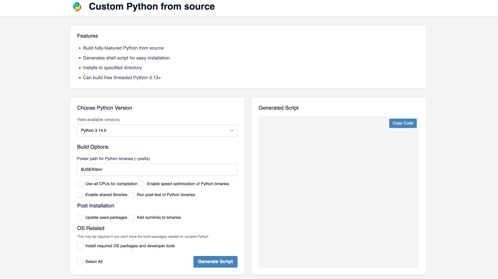
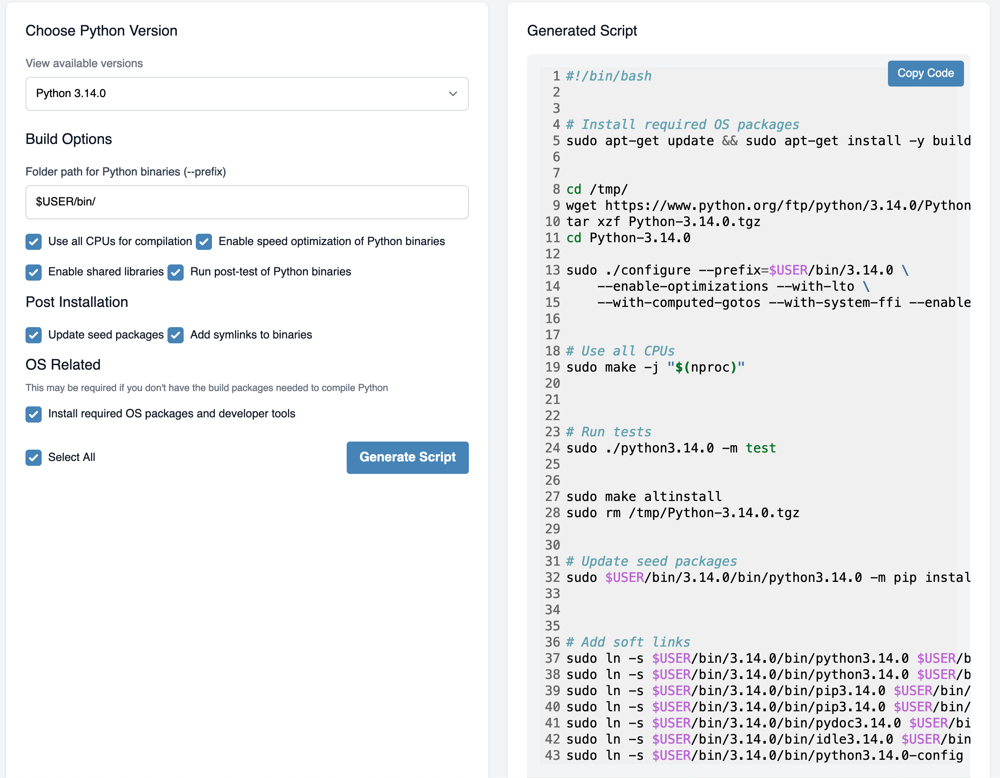
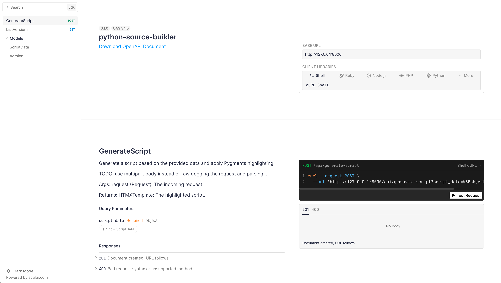

# About

Build Python from source, with 3.13 options.

# Examples






# How to Install

> [!NOTE]  
> `requirements.txt` is for deploys only, not to be used for development.

To install and set up the app, follow these steps:

1. Clone the repository:
    ```bash
    git clone https://github.com/JacobCoffee/gobupython-source-builds.git
    cd python-source-builder
    ```

2. Install app, run app
    ```bash
    make install
    make serve
    ```

3. Open your browser and navigate to: http://localhost:8000

# Contributing

They are welcome.
